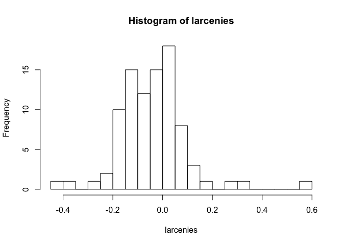
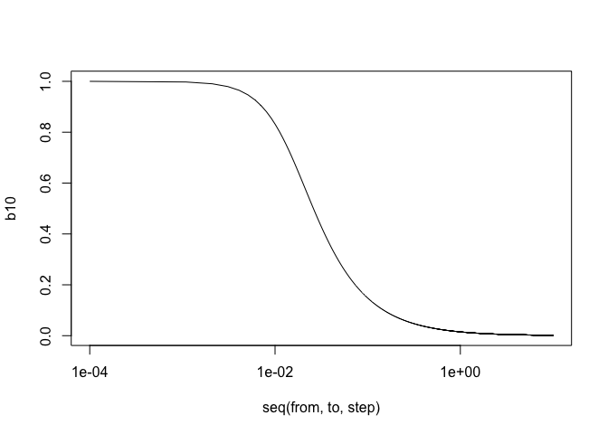

# Bayesian Core - Capítulo 2 - Normal Models
Daysi Febles y Alexander Ramírez  
30/1/2017  


<!-- -->

## 2.2.3 Intervalos de Confianza

Un punto que debe quedar claro desde el principio es que el enfoque Bayesiano es un enfoque/acercamiento inferencial completo. Entonces, cubre la evaluación de confianza, pruebas, predicción, chequeo del modelo y estimación puntual. Vamos a cubrir progresivamente las diferentes facetas del Análisis Bayesiano en otros capítulos de este libro, pero vamos a refefirnos aquí sobre los intervalos de confianza.

Como en todo lo demás, la obtención/derivación de los intervalos de confianza (o regiones de confianza en una configuración más general) está basada en la distribución posterior $\pi(\theta,\mathcal{D})$. Dado que el enfoque Bayesiano trata/procesa al parámetro $\theta$ como una variable aleatoria (se le asigna una distribución), una definición "natural" de la región de confianza sobre $\theta$ es determinar $C(\mathcal{D})$ tal que 
$$
\tag{2.9}
\pi(\theta \in C(\mathcal{D})\ |\ \mathcal{D}) = 1 - \alpha
$$
donde $\alpha$ es un nivel predeterminado así como $0.05$.

**La grán diferencia, desde una perspectiva tradicional, es que la integración se hace sobre el espacio de parámetros, en lugar del espacio muestral. La cantidad $1-\alpha$ entonces corresponde a la probabilidad de que un $\theta$ aleatorio pertenece al conjunto $C(\mathcal{D})$, en lugar de la probabilidad de que un conjunto (intervalo) aleatorio contiene el "verdadero" valor del parámetro $\theta$.**

Dado este cambio en la interpretación de un conjunto de confianza (también llamado conjunto con credibilidad/creible por los Bayesianos), la determinación del mejor intervalo resulta más fácil que en el sentido clásico: simplemente corresponde al valor de $\theta$ con el mayor valor para la distribución posterior.
$$
C(\mathcal{D})=\{\theta; \pi(\theta\ |\ \mathcal{D})\ge k_{\alpha}\},
$$
donde $k_\alpha$ se determina por la restricción de cobertura (2.9). Esta región es llamada *highest posterior density (HPD) region* (región de mayor densidad posterior).

-----

Para **normaldata**, utilizando el parámetro $\theta=(\mu,\sigma^2)$, la distribución posterior marginal sobre $\mu$ utilizando el *a priori* $\pi(\theta)=1/\sigma^2$ es una distribución *t-Student*
$$
\pi(\mu|\mathcal{D})\propto [n(\mu-\bar{x})^2+s_x^2]^{-n/2}
$$
con $n-1=89$ grados de libertad, como se puede ver en (2.7), la región de confianza correspondiente al $95\%$ para $\mu$ es el intervalo $[-0.070,-0.013]$. Note que como el $0$ no pertenece al intervalo, uno puede sentir justificado el reporte de un decrecimiento en el número robos entre 1991 y 1995.

Intervalo sobre $\mu$
$$
[\bar{x}\ -\ t_{\alpha/2,n-1}s_x/\sqrt{n(n-1)},\ \bar{x}\ +\ t_{\alpha/2,n-1}s_x/\sqrt{n(n-1)}]
$$

- La región de confianza correspondiente al $95\%$ para $\mu$ es el intervalo $[-0.070,-0.013]$. Note que como el $0$ no pertenece al intervalo, uno puede sentir justificado el reporte de un decrecimiento en el número robos entre 1991 y 1995.


```r
alpha<-.05
n<-length(larcenies)
xbar<- mean(larcenies)
sx<- sd(larcenies)
prob<-qt(1-alpha/2,df=n-1)
c(xbar-prob*sx/sqrt(n),xbar+prob*sx/sqrt(n))
```

```
## [1] -0.06966541 -0.01285346
```

-----

Mientras que la forma de un intervalo de confianza Bayesiano óptimo es fácilmente derivable, el cálculo de la cota $k_\alpha$ o el conjunto $C(\mathcal{D})$ puede ser muy retador "to allow an analytic construction outside conjugate setups"

-----

### Ejemplo 2.1

Cuando la distribución *a priori* no es conjugada, la distribución posterior no se comporta bien necesariamente. Por ejemplo, si la distribución normal $\mathcal{N}(\mu,1)$ es reemplazada por la distribución de Cauchy, $\mathcal{C}(\mu,1)$, en la verosimilitud
$$
l(\mu|\mathcal{D})=\pi(\mathcal{D}\ |\ \theta)=\prod_{i=1}^{n}f_\mu(x_i)=\frac{1}{\pi^n\prod_{i=1}^n(1+(x_i-\mu)^2)},
$$
no hay un *a priori* conjugado disponible y podemos, por ejemplo, considerar un *a priori* normal para $\mu$, digamos $\mathcal{N}(0,10)$. La distribución posterior, entonces, es proporcional a
$$
\tilde\pi(\mu|\mathcal{D})=\frac{\exp(-\mu^2/20)}{\prod_{i=1}^{n}(1+(x_i-\mu)^2)}.
$$
Una solución analítica de $\tilde\pi(\mu|\mathcal{D})$ no es posible, sólo numérica, y el cálculo de una cota apropiada $k_\alpha$ requiere un nivel extra de cómputos numéricos para obtener la cobertura correcta. La Figura 2.5 nos dá la distribución posterior de $\mu$ para los datos (observaciones) $x_1=-4.3$ y $x_2=3.2$, normalizado por una simple integración trapezoidal, que es, calculando $\tilde\pi(\mu|\mathcal{D})$ en una grilla de ancho $\triangle$ y "and summing up". Para un valor $k$ dado, la misma aproximación trapezoidal se puede utilizar para calcular la cobertura aproximada de la región HDP. Para $\alpha=0.95$, una prueba de ensayo y error (tanteo) del rango de $k$ nos proporciona una aproximación de $k_\alpha=0.0415$ y la región HPD, se representa como en la figura. $\lhd$

**Introducir la figura**

**Fig. 2.5.** Distribución posterior de $\mu$ para una distribución *a priori* $\mathcal{N}(0,10)$ y una región HPD de $95\%$.

 > Dado que la distribución posterior no es necesariamente unimodal, la región HPD puede incluir varios conjuntos no relacionados (disconnected), como se ilustra en el Ejemplo 2.1. Esto puede parecer contraintuitivo desde el punto de vista clásico, pero se debe interpretar como un indicador de indeterminación, ya sea en los datos o en la distribución *a priori*, acerca de los posibles valores del parámetro $\theta$. Note también que las regiones HPD no son independientes de la selección de la medida de referencia que define el volumen (o superficie).

# 2.3 Prueba de Hipótesis

Decidir la validez de algunas premisas o restricciones sobre el parámetro $\theta$ es una gran parte del trabajo del estadístico. (Vamos a lidiar con la validez del modelo completo, por ejemplo, si es o no es apropiada una distribución normal para los datos provistos en la sección 2.5.2 y más generalmente en la sección 6.7.3.). Como el resultado del proceso de decisión es claro (*clearcut*), aceptar (representado por 1) o rechazar (representado por 0), la construcción y la evaluación de los procedimientos es crucial. Mientras que la solución Bayesiana es formalmente muy cercana a un estadístico de la razón de la verosimilitud, sus valores numéricos frecuentemente difieren fuertemente de las soluciones clásicas.

## 2.3.1 Decisiones Cero-Uno

Vamos a formalizar la premisa como espacios de parámetros restringidos, denotado como $\theta\in\Theta_0$.
Por ejemplo, $\theta>0$ corresponde a $\Theta_0=\mathbb{R}^+$.

El enfoque estándar de Neyman Pearson para pruebas de hipótesis se basa en la función de pérdida $0-1$ que penaliza todos los errores igualmente: Si consideramos la prueba de la Hipótesis Nula $H_0: \theta\in\Theta_0$ versus $H_1: \theta\notin\Theta_0$ y denotamos por $d\in\{0,1\}$ la decisión que toma el estadístico y por $\delta$ el procedimiento de decisión correspondiente, la pérdida
$$
L(\theta,d)=\Bigg\{
\begin{array}{ll}
1-d &\text{si } \theta\in\Theta_0\\
d &\text{si no}
\end{array}
$$
y el riesgo asociado
$$
\begin{array}{rl}
R(\theta,\delta) = & \mathbb{E}_\theta[L(\theta,\delta(x))]\\
= & \displaystyle\int_\chi L(\theta,\delta(x))f_\theta(x)dx\\
= & \bigg\{
\displaystyle\begin{array}{lr}
P_\theta(\delta(x)=0), \text{ si }\theta\in\Theta_0\\
P_\theta(\delta(x)=1), \text{ si no}
\end{array}
\end{array}
$$
donde $x$ denota los datos $\mathcal{D}$ disponibles. Bajo la función de pérdida $0-1$, el criterio de decisión de Bayes (estimador) asociado con la distribución *a priori* $\pi$ es
$$
\delta^\pi(x)=\Bigg\{
\begin{array}{lr}
1, \text{ si }P^\pi(\theta\in\Theta_0|x)>P^\pi(\theta\notin\Theta_0|x)\\
0, \text{ si no}
\end{array}
$$
Este estimador se justifica fácilmente sobre una base intuitiva dado que se escoge la hipótesis con la probabilidad posterior mayor. 

Una generalización de la pérdida mencionada anteriormente es la penalización de los errores de una manera diferente cuando la hipótesis nula es verdadera en lugar de cuando es falsa a través de la función de pérdida $0-1$ ponderada ($a_0,a_1>0$),
$$
L_{a_0,a_1}(\theta,d)= \Bigg \{
\begin{array}{ll}
a_0, &\text{ si }\ \theta\in\Theta_0\ \text{ y }\ d=0,\\
a_1, &\text{ si }\ \theta\in\Theta_1\ \text{ y }\ d=1,\\
0,&\text{ si no }
\end{array}
$$

-----

### Ejercicio 2.18.

Muestre que, bajo la función de pérdida $L_{a_0,a_1}$, el estimador de Bayes asociado con la distribución *a priori* $\pi$ es dada por
$$
\delta^\pi(x)=\Bigg\{
\begin{array}{ll}
1, &\text{ si }\ P^\pi(\theta\in\Theta_0|x)>\displaystyle \frac{a_1}{a_0+a_1},\\
0,&\text{ si no }
\end{array}
$$

-----

Sea 
$$
L_{a_0,a_1}(\theta,d)= \Bigg \{
\begin{array}{ll}
a_0, &\text{ si }\ \theta\in\Theta_0\ \text{ y }\ d=0,\\
a_1, &\text{ si }\ \theta\in\Theta_1\ \text{ y }\ d=1,\\
0,&\text{ si no }
\end{array}
$$
siendo $d$ la decisión que toma el estadístico (analista) y $\delta$ es el proceso de decisión. La pérdida esperada de la densidad posterior es
$$
\mathbb{E}[L_{a_0,a_1}(\theta,d)|x] = \bigg\{
\begin{array}{rl}
a_0\ P^\pi(\theta\in\Theta_0|x)\text{, si } d=0\\
a_1\ P^\pi(\theta\in\Theta_1|x)\text{, si } d=1\\
\end{array}
$$
la decisión que minimiza la pérdida posterior es $d=1$ cuando
$$
\begin{array}{rl}
a_0\ P^\pi(\theta\in\Theta_0|x) > & a_1\ P^\pi(\theta\in\Theta_1|x) \\
a_0\ P^\pi(\theta\in\Theta_0|x) > & a_1\ [1-P^\pi(\theta\in\Theta_0|x)]\\
a_0\ P^\pi(\theta\in\Theta_0|x) > & a_1\ -\ a_1P^\pi(\theta\in\Theta_0|x)\\
a_0\ P^\pi(\theta\in\Theta_0|x) + a_1P^\pi(\theta\in\Theta_0|x) > & a_1\ \\
(a_0+a_1)\ P^\pi(\theta\in\Theta_0|x) > & a_1\ \\
\ P^\pi(\theta\in\Theta_0|x) > & \displaystyle\frac{a_1}{a_0+a_1}\ \\
\end{array}
$$
y $0$ en otro caso.

Por lo tanto nos queda
$$
\delta^\pi(x)=\Bigg\{
\begin{array}{ll}
1, &\text{ si }\ P^\pi(\theta\in\Theta_0|x)>\displaystyle \frac{a_1}{a_0+a_1},\\
0,&\text{ si no }
\end{array}
$$

-----

Para esta clase de funciones de pérdida, la hipótesis nula $H_0$ se rechaza cuando la probabilidad posterior de $H_0$ es muy pequeña, el nivel de aceptación $a_1/(a_0+a_1)$ se está determinando por la escogencia de ($a_0,a_1$).

-----

### Ejercicio 2.19.

Cuando $\theta\in\{\theta_0,\theta_1\}$, muestre que el procedimiento Bayesiano sólo depende de la razón/ratio $\varrho_0f_{\theta_0}(x)/(1-\varrho_0)f_{\theta_1}$, donde $\varrho_0$ es el peso *a priori* sobre $\theta_0$.

-----

En este caso $\pi$ le asigna masa $\varrho_0$ a un punto $\theta_0$ y le asigna por otra parte la masa $(1-\varrho_0)$ a $\theta_1$, entonces
$$
\begin{array}{rl}
P^\pi(\theta=\theta_0)=&\displaystyle \frac{\varrho_0 f_{\theta_0}(x)}{\varrho_0 f_{\theta_0}(x)\ +\ \varrho_1 f_{\theta_1}(x)}\\
=&\displaystyle \frac{\varrho_0 f_{\theta_0}(x)}{\varrho_0 f_{\theta_0}(x)\ +\ (1-\varrho_0) f_{\theta_1}(x)}\\
=&\displaystyle \frac{1}{1\ +\ \displaystyle \frac{(1-\varrho_0) f_{\theta_1}(x)}{\varrho_0 f_{\theta_0}(x)}}
\end{array}
$$

-----

Para $x\sim\mathcal{N}(\mu,\sigma^2)$ y $\mu\sim\mathcal{N}(\xi,\tau^2)$, recordemos que $\pi(\mu|x)$ es la distribución normal con $\mathcal{N}(\xi(x),w^2)$ con
$$
\xi(x)=\frac{\sigma^2\xi+\tau^2x}{\sigma^2+\tau^2}\ \text{ y }\ \omega^2=\frac{\sigma^2\tau^2}{\sigma^2+\tau^2}
$$
Para probar $H_0:\mu<0$ calculamos
$$
\begin{array}{rl}
P^\pi(\mu<0|x) = &  \displaystyle P^\pi\Bigg(\frac{\mu-\xi(x)}{\omega}<\frac{-\xi(x)}{\omega} \Bigg) \sim \mathcal{N}(0,1) \\
= & \displaystyle   \Phi\bigg(\frac{-\xi(x)}{\omega}\bigg)
\end{array}
$$
Si $z_{a_0,a_1}$ es el cuantil $\frac{a_1}{a_0+a_1}$ de una distribución normal $\mathcal{N}(0,1)$ (por ejemplo, $\Phi(z_{a_0,a_1})=\frac{a_1}{a_0+a_1}$), aceptamos la hipótesis nula $H_0$ cuando
$$
\begin{array}{rl}
-\xi(x) > & z_{a_0,a_1} \omega \\
-\displaystyle \frac{\sigma^2\xi+\tau^2 x}{\sigma^2+\tau^2}>& z_{a_0,a_1}\omega \\
-\displaystyle \sigma^2\xi-\tau^2x>& z_{a_0,a_1}\omega(\sigma^2+\tau^2) \\
\displaystyle -\tau^2x>& - z_{a_0,a_1}\omega(\sigma^2+\tau^2) - \sigma^2\xi \\
x<& \displaystyle \frac{-z_{ a_0,a_1}\omega(\sigma^2+\tau^2) - \sigma^2\xi}{\tau^2} \\
x<& \displaystyle -\frac{z_{ a_0,a_1}\omega(\sigma^2+\tau^2)}{\tau^2} - \frac{\sigma^2\xi}{\tau^2}
\end{array}
$$
la cota de aceptación superior es
$$
x<-\frac{\sigma^2}{\tau^2}\xi - \bigg(1+ \frac{\sigma^2}{\tau^2} \bigg)z_{a_0,a_1}\omega
$$
Esto ilustra una vez más la falta de robustez de la distribución *a priori* conjugada: Esta cota puede ser cualquier real cuando $\xi$ varía en $\mathbb{R}$.

-----

### Ejercicio 2.20.

Muestre que el límite de la probabilidad posterior $P^\pi(\mu<0|x)$ cuando $\xi$ tiende a $0$ y $\tau$ tiende a $\infty$ es $\Phi(-x/\sigma)$.

-----

Para $x\sim\mathcal{N}(\mu,\sigma^2)$ y $\mu\sim\mathcal{N}(\xi,\tau^2)$, recordemos que $\pi(\mu|x)$ es la distribución normal con $\mathcal{N}(\xi(x),w^2)$ con $P^\pi(\mu<0|x)=\Phi\bigg(\frac{-\xi(x)}{\omega}\bigg)$
$$
\xi(x)=\frac{\sigma^2\xi+\tau^2x}{\sigma^2+\tau^2}\ \text{ y }\ \omega^2=\frac{\sigma^2\tau^2}{\sigma^2+\tau^2}
$$
Entonces
$$
\begin{array}{rl}
\Phi\bigg(\frac{-\xi(x)}{\omega}\bigg)=&\Phi\Bigg(-\displaystyle \frac{\displaystyle \sigma^2\xi+\tau^2x}{\sigma^2+\tau^2}\Bigg/{\displaystyle\sqrt{\frac{\sigma^2\tau^2}{\sigma^2+\tau^2}}}\Bigg)\\
=&\Phi\Bigg(-\displaystyle \frac{\displaystyle \sigma^2\xi+\tau^2x}{\sqrt{\sigma^2+\tau^2} \sqrt{\sigma^2\tau^2}}\Bigg)\\
\end{array}
$$
ahora vamos a ver que pasa cuando $\xi\to 0$
$$
\lim_{\xi\to 0}-\displaystyle \frac{\displaystyle \sigma^2\xi+\tau^2x}{\sqrt{\sigma^2+\tau^2} \sqrt{\sigma^2\tau^2}}=-\displaystyle \frac{\displaystyle \tau^2x}{\sqrt{\sigma^2+\tau^2} \sqrt{\sigma^2\tau^2}}
$$
ahora vamor a ver que pasa cuando $\tau\to\infty$
$$
\begin{array}{rl}
\displaystyle \lim_{\tau\to\infty} -\displaystyle \frac{\displaystyle \tau^2x}{\sqrt{\sigma^2+\tau^2} \sqrt{\sigma^2\tau^2}}=& \displaystyle \lim_{\tau\to\infty}-\frac{\displaystyle \tau^2x}{\sqrt{\tau^2(\frac{\sigma^2}{\tau^2}+1}) \sigma\ \tau} \\
=&\displaystyle \lim_{\tau\to\infty}-\frac{\displaystyle \tau^2x}{\tau^2\ \sigma \sqrt{\frac{\sigma^2}{\tau^2}+1}}\\
=&\displaystyle \lim_{\tau\to\infty}-\frac{\displaystyle x}{\sigma \sqrt{\frac{\sigma^2}{\tau^2}+1}}=-\frac{x}{\sigma}
\end{array}
$$

-----

## 2.3.2 El *Factor de Bayes*

Una noción central a las pruebas Bayesianas es el *Factor de Bayes*
$$
B_{10}^\pi=\displaystyle \frac{\frac{P^\pi(\theta\in\Theta_1|x)}{P^\pi(\theta\in\Theta_0|x)}}{\frac{P^\pi(\theta\in\Theta_1)}{P^\pi(\theta\in\Theta_0)}}=\displaystyle \frac{\frac{P^\pi(\mathcal{M}_1|x)}{P^\pi(\mathcal{M}_0|x)}}{\frac{P^\pi(\mathcal{M}_1)}{P^\pi(\mathcal{M}_0)}}
$$
que corresponde a las posibilidades clásica (classical odds) o razón de verosimilitud, la diferencia está en que los parámetros se integran en lugar de maximizarce bajo cada modelo $\mathcal{M}_1$ versus $\mathcal{M}_0$.

Dado que es una simple transformada uno a uno de la probabilidad posterior, se puede usar para pruebas Bayesianas sin utilizar una función de pérdida específica, por ejemplo usando la escala de evidencia de Jeffreys:

- Si $0\le\log_{10}(B_{10}^\pi)<\frac{1}{2}$ la evidencia en contra $H_0$ es débil
- Si $\frac{1}{2}\le\log_{10}(B_{10}^\pi)<1$ la evidencia es sustancial
- Si $1\le\log_{10}(B_{10}^\pi)<2$ la evidencia es fuerte y 
- Si $\log_{10}(B_{10}^\pi)\ge2$ la evidencia es decisiva

A pesar de que esta escala está lejos de ser justificada bajo principios estrictos, provee una referencia para evaluar las hipótesis sin necesidad de definir las probabilidades *a priori* $H_0:\theta\in\Theta_0$ versus $H_1:\theta\in\Theta_1$, lo cual es una de las ventajas de utilizar el *Factor Bayesiano*.

En general, el *Factor de Bayes* obviamente depende de la información *a priori*, pero todavía se considera una respuesta Bayesiana objetiva en parte por que elimina la influencia del modelo *a priori* y enfatiza el rol de las observaciones.

Alternativamente, se puede notar (perceived) como una razón de verosimilitud Bayesiana dado que si $\pi_0$ y $\pi_1$ son distribuciones *a priori* bajo $H_0$ y $H_1$, respectivamente y si $P^\pi(\theta\in\Theta_0)=P^\pi(\theta\in\Theta_1)=\frac{1}{2}$, $B_{10}^\pi$ se puede expresar como
$$
B_{10}^\pi=\frac{\displaystyle\int_{\Theta_1}f_\theta(x)\pi_1(\theta)d\theta}{\displaystyle\int_{\Theta_0}f_\theta(x)\pi_0(\theta)d\theta}=\frac{m_1(x)}{m_0(x)}
$$
en la cual reemplazamos las verosimilitudes con las marginales bajo ambas hipótesis.

Cuando la hipótesis que se va a probar es una hipótesis nula puntual, $H_0:\theta=\theta_0$, hay dificultades en la construcción de un procedimiento Bayesiano, dado que, para una distribución *a priori* contínua $\pi$
$$
P^\pi(\theta=\theta_0)=0
$$
Obviamente, las hipótesis nulas puntuales se pueden criticar y considerar como artificiales e imposibles de probar (*¿Con cuanta frecuencia se puede distinguir entre $\theta=0$ de $\theta=0.0001$?!*), sin embargo también se deben realizar como parte de los requerimientos del análisis estadístico del día a día y también se pueden ver como una representación conveniente de algunos problemas de escogencia del modelo (model choice problems) que serán tratados luego.

La prueba de hipótesis nulas puntuales ameritan una modificación de la distribución *a priori* tal que cuando se prueba $H_0:\theta\in\Theta_0$ versus $H_1:\theta\in\Theta_1$, se cumple que
$$
\pi(\Theta_0)>0\ \ y \ \ \pi(\Theta_1)>0
$$
independientemente de los cálculos (measures) de $\Theta_0$ y $\Theta_1$ para la distribución *a priori* original, lo cual significa que la distribución *a priori* se puede descomponer como
$$
\pi(\theta)=P^\pi(\theta\in\Theta_0)\times\pi_0(\theta)+P^\pi(\theta\in\Theta_1)\times\pi_1(\theta)
$$
con pesos positivos en ambos conjuntos $\Theta_0$ y $\Theta_1$.

  > Note que esta modificación tiene sentido tanto desde el punto de vista de la información como operativo. Si $H_0:\theta=\theta_0$, el hecho de que la hipótesis es puesta a prueba implica que $\theta=\theta_0$ es una posibilidad y trae información *a priori* adicional sobre el parámetro $\theta$. Además, si se prueba $H_0$ y es aceptada, esto significa, en la mayoría de los casos, que el modelo (reducido) bajo $H_0$ se utilizará en lugar del modelo (completo) considerado anteriormente. Entonces, una distribución *a priori* bajo el modelo reducido debe estar disponible para inferencias posteriores potenciales. (Obviamente, el hecho de que esta inferencia posterior depende de la selección de la hipótesis nula $H_0$ también se debería tomar en consideración.)

En el caso especial $\Theta_0=\{\theta_0\}$, $\pi_0$ es la masa de *Dirac* en $\theta_0$, que significa que $P^{\pi_0}(\theta=\theta_0)=1$, y se requiere introducir un peso *a priori* separado de $H_0$, digamos,
$$
\rho=P(\theta=\theta_0)\ \text{ y }\ \pi(\theta)=\rho\ 1_{\theta_0}(\theta)\ +\ (1-\rho)\pi_1(\theta) 
$$
entonces,
$$
\begin{array}{rl}
\displaystyle \pi(\Theta_0|x)&=\displaystyle \frac{f_{\theta_0}(x)\rho}{\displaystyle\int f_\theta(x)\pi(\theta)d\theta} \\
&=\displaystyle \frac{f_{\theta_0}(x)\rho}{f_{\theta_0}(x)\rho\ +\ (1-\rho)m_1(x)}
\end{array}
$$

Para $x\sim\mathcal{N}(\mu,\sigma^2)$ y $\mu\sim\mathcal{N}(\xi,\tau^2)$, considere la prueba $H_0:\mu=0$. Podemos escoger $\xi$ igual a $0$ si no contamos con información *a priori* adicional. 
$$
\begin{array}{rl}
m_1(x)=&\displaystyle\int_{\Theta_1}f_\theta(x)\pi_1(\theta)d\theta\\
=&\displaystyle\int_{\Theta_1} \frac{1}{\sqrt{2\pi}\sigma}\exp\bigg\{-\frac{(x-\mu)^2}{2\sigma^2}\bigg\}
\frac{1}{\sqrt{2\pi}\tau}\exp\bigg\{-\frac{(\mu-\xi)^2}{2\tau^2}\bigg\}d\mu
\end{array}
$$
vamos a ver los exponentes de las exponenciales
$$
\begin{array}{rl}
-\frac{1}{2}\frac{(x-\mu)^2}{\sigma^2}-\frac{1}{2}\frac{(\mu-\xi)^2}{\tau^2}=&-\frac{1}{2}\frac{x^2-2x+\mu^2}{\sigma^2}-\frac{1}{2}\frac{\mu^2-2\mu\xi+\xi^2}{\tau^2}\\
=&-\frac{1}{2}\bigg[\frac{x^2}{\sigma^2}-\frac{2x\mu}{\sigma^2}+\frac{\mu^2}{\sigma^2}+\frac{\mu^2}{\tau^2}-\frac{2\mu\xi}{\tau^2}+\frac{\xi^2}{\tau^2}  \bigg]\\
=&-\frac{1}{2}\bigg[\bigg(\frac{x^2}{\sigma^2}+\frac{\xi^2}{\tau^2} \bigg)+\mu^2\bigg(\frac{1}{\sigma^2}+\frac{1}{\tau^2} \bigg) - 2\mu\bigg( \frac{x}{\sigma^2}+\frac{\xi}{\tau^2}  \bigg)  \bigg]\\
=&-\frac{1}{2}\bigg[\bigg(\frac{x^2}{\sigma^2}+\frac{\xi^2}{\tau^2} \bigg)+\bigg(\frac{1}{\sigma^2}+\frac{1}{\tau^2} \bigg)\bigg(\mu^2- 2\mu\bigg( \frac{x\tau^2+\xi\sigma^2}{\sigma^2\tau^2} \bigg)\bigg(\frac{\sigma^2\tau^2}{\sigma^2+\tau^2}\bigg)  \bigg]\\
=&-\frac{1}{2}\bigg[\bigg(\frac{x^2}{\sigma^2}+\frac{\xi^2}{\tau^2} \bigg)+\bigg(\frac{\sigma^2+\tau^2}{\sigma^2\tau^2} \bigg)\bigg\{\mu^2- 2\mu\bigg( \frac{x\tau^2+\xi\sigma^2}{\sigma^2+\tau^2} \bigg) +\bigg( \frac{x\tau^2+\xi\sigma^2}{\sigma^2+\tau^2} \bigg)^2-\bigg( \frac{x\tau^2+\xi\sigma^2}{\sigma^2+\tau^2} \bigg)^2 \bigg\}  \bigg]\\
=&-\frac{1}{2}\bigg[\bigg(\frac{x^2}{\sigma^2}+\frac{\xi^2}{\tau^2} \bigg)+\bigg(\frac{\sigma^2+\tau^2}{\sigma^2\tau^2} \bigg)\bigg\{\bigg(\mu -  \frac{x\tau^2+\xi\sigma^2}{\sigma^2+\tau^2} \bigg)^2-\bigg( \frac{x\tau^2+\xi\sigma^2}{\sigma^2+\tau^2} \bigg)^2 \bigg\}  \bigg]\\
=&-\frac{1}{2}\bigg[\bigg(\frac{x^2}{\sigma^2}+\frac{\xi^2}{\tau^2} \bigg)+\bigg\{\bigg(\frac{\sigma^2+\tau^2}{\sigma^2\tau^2} \bigg)\bigg(\mu -  \frac{x\tau^2+\xi\sigma^2}{\sigma^2+\tau^2} \bigg)^2-\bigg(\frac{\sigma^2+\tau^2}{\sigma^2\tau^2} \bigg)\bigg( \frac{x\tau^2+\xi\sigma^2}{\sigma^2+\tau^2} \bigg)^2 \bigg\}  \bigg]\\
=&-\frac{1}{2}\bigg[\bigg(\frac{x^2}{\sigma^2}+\frac{\xi^2}{\tau^2} \bigg)+\bigg\{\bigg(\frac{\sigma^2+\tau^2}{\sigma^2\tau^2} \bigg)\bigg(\mu -  \frac{x\tau^2+\xi\sigma^2}{\sigma^2+\tau^2} \bigg)^2-
\frac{(x\tau^2+\xi\sigma^2)^2}{\sigma^2\tau^2(\sigma^2+\tau^2)}  \bigg\}  \bigg]\\
\end{array}
$$

Ahora desarrollamos $m_1(x)$
$$
\begin{array}{rl}
m_1(x)=&\displaystyle \int_{\Theta_1}\frac{1}{\sqrt{2\pi}\sigma}\exp\bigg\{ -\frac{1}{2}\bigg[\bigg(\frac{x^2}{\sigma^2}+\frac{\xi^2}{\tau^2} \bigg)+\bigg\{\bigg(\frac{\sigma^2+\tau^2}{\sigma^2\tau^2} \bigg)\bigg(\mu -  \frac{x\tau^2+\xi\sigma^2}{\sigma^2+\tau^2} \bigg)^2-
\frac{(x\tau^2+\xi\sigma^2)^2}{\sigma^2\tau^2(\sigma^2+\tau^2)}  \bigg\}  \bigg]\bigg\}\frac{1}{\sqrt{2\pi}\tau}d\mu\\
=&\vdots\\
=&\frac{1}{\sqrt{2\pi}\sqrt{\sigma^2+\tau^2}}\exp\bigg\{ -\frac{1}{2}\frac{x^2}{\sigma^2+\tau^2}\bigg\}
\end{array}
$$
Como
$$
f_0(x)=\frac{1}{\sqrt{2\pi\sigma^2}}\exp\bigg\{-\frac{(x-0)^2}{2\sigma^2} \bigg\}=\frac{1}{\sqrt{2\pi}\sigma}\exp\bigg\{-\frac{x^2}{2\sigma^2} \bigg\}\sim\mathcal{N(\mu,\sigma^2)}\text{ con }\mu=0
$$

entonces $B_{10}^\pi$
$$
\begin{array}{rl}
B_{10}^\pi=\frac{m_1(x)}{f_0(x)}=&\frac{\frac{1}{\sqrt{2\pi}\sqrt{\sigma^2+\tau^2}}\exp\bigg\{ -\frac{1}{2}\frac{x^2}{\sigma^2+\tau^2}\bigg\}}{\frac{1}{\sqrt{2\pi}\sigma}\exp\bigg\{-\frac{x^2}{2\sigma^2} \bigg\}}\\
=&\vdots\\
=&\frac{\sigma}{\sqrt{\sigma^2+\tau^2}}\exp\bigg\{\frac{1}{2}\frac{x^2\tau^2}{\sigma^2(\sigma^2+\tau^2)} \bigg\}
\end{array}
$$

Entonces el *Factor de Bayes* es la razón de las marginales bajo ambas hipótesis, $\mu=0$ y $\mu\ne 0$,
$$
\begin{array}{ll}
B_{10}^\pi=\displaystyle \frac{m_1(x)}{f_0(x)}&=\displaystyle \frac{\sigma}{\sqrt{\sigma^2+\tau^2}}\frac{e^{-x^2/2(\sigma^2+\tau^2)}}{e^{-x^2/2\sigma^2}} \\
&=\displaystyle \sqrt{\frac{\sigma^2}{\sigma^2+\tau^2}}\exp\bigg\{\frac{\tau^2x^2}{2\sigma^2(\sigma^2+\tau^2)} \bigg\}
\end{array}
$$
y si partimos de que $\rho=P(\theta=\theta_0)$ y $\pi(\theta)=\rho 1_{\Theta_0}(\theta)+(1-\rho)\pi_1(\theta)$
$$
\pi(\Theta_0|x)=\frac{f_{\Theta_0}(x)\rho}{\int f_{\Theta_0}(x)\pi(\theta)d\theta}=\frac{f_{\Theta_0}(x)\rho}{f_{\Theta_0}(x)\rho+(1-\rho)m_1(x)}
$$

entonces $\pi(\mu=0|x)$
$$
\pi(\mu=0|x)=\bigg[1\ +\ \frac{1-\rho}{\rho} \displaystyle \sqrt{\frac{\sigma^2}{\sigma^2+\tau^2}}\exp\bigg\{\frac{\tau^2x^2}{2\sigma^2(\sigma^2+\tau^2)} \bigg\}\bigg]^{-1}
$$
es la probabilidad posterior de $H_0$. La Tabla 2.1 ofrece una idea de los valores de la probabilidad posterior cuando la cantidad normalizada $x/\sigma$ varía. Esta probabilidad posterior obviamente depende de la selección de la variancia *a priori* $\tau^2$: La dependencia es en realidad muy severa, como veremos más adelante con la paradoja de *Jeffreys Lindley*.

**Tabla 2.1.** Probabilidad posterior de $\mu=0$ para valores diferentes de $z=x/\sigma$, $\rho=1/2$ y para $\tau=\sigma$ (fila superior), $\tau^2=10\sigma^2$ (fila inferior).

$$
\begin{array}{ccccc}
\hline
z              & 0 & 0.68  & 1.28  & 1.96  \\ \hline
\pi(\mu=0|z)   & 0.586                  & 0.557 & 0.484 & 0.351 \\ \hline
\pi(\mu=0|z)   & 0.768                  & 0.729 & 0.612 & 0.366 \\ \hline
\end{array}
$$
Para **normaldata**, si escogemos $\tau$ igual a $0.1$, el *Factor de Bayes* contra $\mu=0$ sólo depende de $\overline{x}_n\sim\mathcal{N}(\mu,\hat\sigma^2/90)$ y es igual a
$$
B_{10}^\pi(\overline{x}_n)=\sqrt{\frac{\hat\sigma^2}{\hat\sigma^2+n\tau^2}}\exp\bigg\{\frac{n\tau^2\ \overline{x}^2_n}{2\hat\sigma^2(\hat\sigma^2+n\tau^2)} \bigg\}=0.1481
$$
El conjunto de datos, por tanto, favorece la hipótesis nula $H_0:\mu=0$. Sin embargo, otras elecciones de $\tau$ pueden resultar en evaluaciones numéricas diferentes, como se muestra en la Figura 2.6, como el *Factor de Bayes* varía entre $1$ y $0$ así como $\tau$ crece de $0$ a $\infty$.


```r
from<-10^-4
to<-10
step<-0.001

b10<-c()
sdsqred<-sd(larcenies)^2
n<-length(larcenies)
xbarsqred<-mean(larcenies)^2

#testing
tau<-0.1
value<-sqrt(sdsqred/(sdsqred+n*tau^2))*
  exp(n*tau^2*xbarsqred/(2*sdsqred*(sdsqred+n*tau^2)))
value
```

```
## [1] 0.1480872
```

```r
value<-0
tau<-from
while (tau<=to) {
  value<-sqrt(sdsqred/(sdsqred+n*tau^2))*
    exp(n*tau^2*xbarsqred/(2*sdsqred*(sdsqred+n*tau^2)))
  b10<-c(b10,value)
  tau<-tau+step
}
plot(seq(from,to,step),b10,type = "l",log = "x",xlim=c(from, to))
```

<!-- -->


**Figura 2.6.** Datos **normaldata**: Rango del *Factor de Bayes* $B_{10}^\pi$ cuando $\tau$ va de $10^{-4}$ a 10. (El eje $x$ está en escala logarítmica)

## 2.3.3 El veto a las distribuciones *a priori* impropias

Desafortunadamente, esta descomposición de la distribución *a priori* en dos sub distribuciones *a priori* genera una seria dificultad relacionada con las distribuciones *a priori* imprópias, que implica en términos prácticos, el veto de su uso en situaciones de prueba (testing situations). De hecho, cuando se utiliza la representación
$$
\pi(\theta)=P(\theta\in\Theta_0)\times\pi_0(\theta)+P(\theta\in\Theta_1)\times\pi_1(\theta)
$$
los pesos $P(\theta\in\Theta_0)$ y $P(\theta\in\Theta_1)$ son significativos sólo si $\pi_0$ y $\pi_1$ son densidades de probabilidad normalizadas. De lo contrario, no se pueden interpretar como *pesos*.

Cuando $x\sim\mathcal{N}(\mu,1)$ y $H_0:\mu=0$, la distribución *a priori* imprópia (Jeffreys) es $\pi_1(\mu)=1$; si escribimos
$$
\pi(\mu)=\frac{1}{2} 1_{0}(\mu)+\frac{1}{2} \cdotp 1
$$
entonces la probabilidad posterior es
$$
\pi(\mu=0|x)=  \frac{\displaystyle e^{-\frac{x^2}{2}}}{e^{-\frac{x^2}{2}}\ +\ \displaystyle \int_{-\infty}^{\infty}e^{-\frac{(x-\theta)^2}{2}}}=\frac{1}{1+\sqrt{2\pi}\ e^{\frac{x^2}{2}}}
$$
Una primera consecuencia de esta elección la probabilidad posterior de $H_0$ es acotada superiormente por
$$
\pi(\mu=0|x)\le\frac{1}{(1+\sqrt{2\pi})}=0.285
$$
La Tabla 2.2 provee la evolución (el cambio) de esta probabilidad cuando $x$ se separa del $0$. Un punto interesante es que los valores numéricos, de alguna forma, coinciden con los *p*-valores utilizados en las pruebas de hipótesis clásicas (Casella and Berger, 2001).

**Tabla 2.2.** Probabilidad posterior de $H_0:\mu=0$ para la distribución *a priori* de Jeffrey $\pi_1(\mu)=1$ bajo $H_1$.

$$
\begin{array}{cccccc}
\hline
x              & 0     & 1.0   & 1.65  & 1.96  & 2.58  \\ \hline
\pi(\mu=0|x)   & 0.285 & 0.195 & 0.089 & 0.055 & 0.014 \\ \hline
\end{array}
$$

-----  
  
  > Si estamos interesados en probar $H_0: \theta\le 0$ versus $H_1:\theta>0$ entonces la probabilidad posterior es
  $$
    \pi(\theta\le 0|x)=\frac{1}{\sqrt{2\pi}}\int_{-\infty}^0 e^{-\frac{(x-\theta)^2}{2}}d\theta=\Phi(-x)
  $$
  y la respuesta es ahora *exáctamente* el *p*-valor que encontramos en la estadística clásica.

-----

Para **normaldata**, si consideramos el párametro $\theta=(\mu,\sigma^2)$ con una distribución que proviene de una distribución *a priori* no informativa $\pi(\theta)=1/\sigma^2$, la probabilidad posterior de que $\mu$ sea positiva es una probabilidad de que una distribución t-Student sea positiva con $89$ grados de libertad, media $-0.0144$ y variancia $0.000206$. Esto es esencialmente una distribución normal $\mathcal{N}(-0.0144,0.000206)$ y la probabilidad correspondiente es $0.0021$, la cual es muy pequeña para la hipótesis $H_0:\mu>0$ se sostenga bajo cualquier verosimilitud.


-----

La dificultad en el uso de una distribución *a priori* imprópia se relaciona a la llamada paradoja de *Jeffrey Lindley*, un fenómeno que muestra que los argumentos limitantes (limiting arguments) no son válidos en situaciones de pruebas de hipótesis. Por el contrario en estimación, las distribuciones *a priori* no informativas no corresponden mas al límite de inferencias conjugadas. De hecho, para una distribución *a priori* conjugada, la probabilidad posterior
$$
\pi(\mu=0|x)=\bigg[1\ +\ \frac{1-\rho_0}{\rho_0} \displaystyle \sqrt{\frac{\sigma^2}{\sigma^2+\tau^2}}\exp\bigg\{\frac{\tau^2x^2}{2\sigma^2(\sigma^2+\tau^2)} \bigg\}\bigg]^{-1}
$$
converge a $1$ cuando $\tau$ va a $+\infty$, para cada valor de $x$, como se ilustró en la Figura 2.6.
Este procedimiento no informativo, obviamente difiere de la respuesta no informativa previa $[1+\sqrt{2\pi}\exp(x^2/2)]^{-1}$.

El principal obstáculo (bars us) que impide el uso de *a priori* imprópios en uno o dos conjuntos $\Theta_0$ y $\Theta_1$ es una dificultad para normalizar (normalizing difficulty): Si $g_0$ y $g_1$ son medidas (en lugar de probabilidades) sobre los subespacios $\Theta_0$ y $\Theta_1$, la selección de las constantes normalizadoras influencia en *Factor de Bayes*. De hecho, cuando $g_i$ es reemplazada por $c_i g_i (i=0,1)$, donde $c_i$ es una constante arbitraria, el *Factor de Bayes* es multiplicado por $c_0/c_1$. Entonces, por ejemplo, si el *a priori* de Jeffrey es uniforme y $g_0=c_0$,$g_1=c_1$, la probabilidad posterior
$$
\begin{array}{rr}
\displaystyle \pi(\theta\in\Theta_0|x)=&\frac{\displaystyle \rho_0c_0\int_{\Theta_0}f(x|\theta)d\theta}{\displaystyle \rho_0c_0\int_{\Theta_0}f(x|\theta)d\theta\ +\ (1-\rho_0)c_1\int_{\Theta_1}f(x|\theta)d\theta}\\
=&\frac{\displaystyle \rho_0\int_{\Theta_0}f(x|\theta)d\theta}{\displaystyle \rho_0\int_{\Theta_0}f(x|\theta)d\theta\ +\ (1-\rho_0)[c_1/c_0]\int_{\Theta_1}f(x|\theta)d\theta}
\end{array}
$$
es completamente determinado por la selección de $[c_0/c_1]$. Esto implica, por ejemplo, que la función $[1+\sqrt{2\pi}\exp(x^2/2)]^{-1}$ obtenida previamente no tiene ninguna validez.

  > Dado que los *a priori* imprópios son una parte esencial del enfoque Bayesiano, han habido muchas propuestas para superar este obstáculo. Muchos utilizan una herramienta (device) que transforma el *a priori* en una distribución de probabilidad utilizando una porción de los datos $\mathcal{D}$ y luego utilizan la otra parte de los datos para realizar una prueba de hipótesis en una situación estándar. La variedad de soluciones disponibles se debe a las muchas posibilidades de eliminar la dependencia en la selección de una porción de los datos utilizados en la primera parte. El procedimiento resultante es llamado *pseudo Factor de Bayes*, aunque algunos realmente sean *Factores de Bayes*. Ver Robert (2001, Capítulo 6) para más detalles.
  
-----

Para **CMBdata**, considere dos muestras construidas tomando dos segmentos sobre la imagen, como se ve en la Figura 2.7.. Podemos considerar esas muestras como, $(x_1,\ldots,x_n)$ y $(y_1,\ldots,y_n)$, ambas provenientes de una distribución normal, $\mathcal{N}(\mu_x, \sigma^2)$ y $\mathcal{N}(\mu_y, \sigma^2)$. La pregunta de interés es si ambas medias son iguales, $H_0:\mu_x=\mu_y$.

**FALTA LA GRAFICA**

**Figura 2.7.** Datos **CMBdata**: Muestras del conjunto de datos representadas por segmentos de recta.

Para tomar ventaja de la estructura de este modelo, podemos asumir que $\sigma^2$ es el mismo error de medición bajo ambos modelos y por tanto comparten la misma distribución *a priori*. Esto significa que el *Factor de Bayes*
$$
B_{10}^\pi=\frac{\int l(\mu_x,\mu_y,\sigma|\mathcal{D})\pi(\mu_x,\mu_y)\pi_\sigma(\sigma^2)d\sigma^2d\mu_x d\mu_y}{\int l(\mu,\sigma|\mathcal{D})\pi_\mu(\mu)\pi_\sigma(\sigma^2)d\sigma^2d\mu}
$$
no depende de la constante de normalización utilizada para $\pi_\sigma(\sigma^2)$ y por tanto todavía podemos utilizar *a priori* imprópios como $\pi_\sigma(\sigma^2)=1/\sigma^2$ en este caso. Adicionalmente, podemos reescribir $\mu_x$ y $\mu_y$ como $\mu_x=\mu-\xi$ y $\mu_y=\mu+\xi$ respectivamente y utilizar un *a priori* de la forma $\pi(\mu,\xi)=\pi_\mu(\mu)\pi_\xi(\xi)$ en la nueva parametrización, así, de nuevo, el mismo *a priori* $\pi_\mu$ se puede utilizar bajo ambas $H_0$ y su alternativa. La misma cancelación de la constante de normalización ocurre para $\pi_\mu$ y la selección del *a priori* $\pi_\mu(\mu)=1$ y $\xi\sim\mathcal{N}(0,1)$ nos da
$$
\begin{array}{rl}
B_{10}^\pi=&\frac{\displaystyle \int\exp-\frac{n}{2\sigma^2}[(\mu-\xi-\bar{x})^2+(\mu+\xi-\bar{y})^2+S^2]\sigma^{-2n-2}e^{-\xi^2/2}/\sqrt{2\pi}\ d\sigma^2\ d\mu \ d\xi}
{\displaystyle \int\exp-\frac{n}{2\sigma^2}[(\mu-\bar{x})^2+(\mu-\bar{y})^2+S^2]\sigma^{-2n-2}\ d\sigma^2\ d\mu}\\
=&\frac{\displaystyle \int[(\mu-\xi-\bar{x})^2+(\mu+\xi-\bar{y})^2+S^2]^{-n}e^{-\xi^2/2}/\sqrt{2\pi}\ d\mu \ d\xi}
{\displaystyle \int[(\mu-\bar{x})^2+(\mu-\bar{y})^2+S^2]^{-n}\ d\mu}
\end{array}
$$

donde $S$ denota la media
$$
S=\frac{1}{n}\sum_{i=1}^{n}(x_i-\bar{x})^2+\frac{1}{n}\sum_{i=1}^{n}(y_i-\bar{y})^2
$$

Mientras que el denominador se puede integrar, el numerador no. Una aproximación numérica de $B_{10}^\pi$ es necesaria. Este asunto será tratado en la Sección 2.4.

-----

### Ejercicio 2.21.

Recordemos que la constante de normalización para la distribución t-Student $\tau(\nu,\mu,\sigma^2)$ es
$$
\displaystyle \frac{\frac{\Gamma\bigg(\frac{\nu+1}{2}\bigg)}{\Gamma\big(\frac{\nu}{2}\big)}}{\sigma\sqrt{\nu\pi}}=\displaystyle \frac{\Gamma\bigg(\frac{\nu+1}{2}\bigg)}{\sigma\sqrt{\nu\pi}\ \Gamma\big(\frac{\nu}{2}\big)}
$$

Calcule el valor de la integral en el denominador de $B_{10}^\pi$ previo.

-----

Primero vamos a desarrollar
$$
\begin{array}{rl}
(\mu-\bar{x})^2+(\mu-\bar{y})^2=&(\mu^2-2\mu\bar{x}+\bar{x}^2)+(\mu^2-2\mu\bar{y}+\bar{y}^2)\\
=&2\mu^2-2\mu(\bar{x}+\bar{y})+\bar{x}^2+\bar{y}^2\\
=&2(\mu^2-\mu(\bar{x}+\bar{y}))+\bar{x}^2+\bar{y}^2\\
=&2(\mu^2-\mu(\bar{x}+\bar{y}) + \big(\frac{\bar{x}+\bar{y}}{2}\big)^2-\big(\frac{\bar{x}+\bar{y}}{2}\big)^2)+\bar{x}^2+\bar{y}^2\\
=&2([\mu- \big(\frac{\bar{x}+\bar{y}}{2}\big)]^2-\big(\frac{\bar{x}+\bar{y}}{2}\big)^2)+\bar{x}^2+\bar{y}^2\\
=&2[\mu- \big(\frac{\bar{x}+\bar{y}}{2}\big)]^2-2\big(\frac{\bar{x}+\bar{y}}{2}\big)^2+\bar{x}^2+\bar{y}^2\\
=&2[\mu- \big(\frac{\bar{x}+\bar{y}}{2}\big)]^2-\big(\frac{\bar{x}^2+2\bar{x}\bar{y}+\bar{y}^2}{2}\big)+2\frac{\bar{x}^2}{2}+2\frac{\bar{y}^2}{2}\\
=&2[\mu- \big(\frac{\bar{x}+\bar{y}}{2}\big)]^2-\frac{\bar{x}^2+2\bar{x}\bar{y}+\bar{y}^2-2\bar{x}^2-2\bar{y}^2}{2}\\
=&2[\mu- \big(\frac{\bar{x}+\bar{y}}{2}\big)]^2+\frac{\bar{x}^2-2\bar{x}\bar{y}+\bar{y}^2}{2}\\
=&2[\mu- \big(\frac{\bar{x}+\bar{y}}{2}\big)]^2+\frac{(\bar{x}-\bar{y})^2}{2}
\end{array}
$$
sustituyendo esta expresión en el denominador de la integral anterior, tenemos
$$
\begin{array}{rl}
\displaystyle \int[(\mu-\bar{x})^2+(\mu-\bar{y})^2+S^2]^{-n}d\mu=&\displaystyle \int \Bigg(2[\mu- \big(\frac{\bar{x}+\bar{y}}{2}\big)]^2+\frac{(\bar{x}-\bar{y})^2}{2}+S^2\Bigg)^{-n}d\mu\\
=&\displaystyle \int\bigg(2\bigg[ [\mu- \big(\frac{\bar{x}+\bar{y}}{2}\big)]^2+\frac{(\bar{x}-\bar{y})^2}{4}+\frac{S^2}{2} \bigg]\bigg)^{-n}d\mu\\
=&2^{-n}\displaystyle \int\bigg( [\mu- \big(\frac{\bar{x}+\bar{y}}{2}\big)]^2+\frac{(\bar{x}-\bar{y})^2}{4}+\frac{S^2}{2}\bigg)^{-n}d\mu
\end{array}
$$
si $\nu=2n-1$ entonces $n=(\nu+1)/2$, sustituyendo
$$
\begin{array}{rl}
\displaystyle \int[(\mu-\bar{x})^2+(\mu-\bar{y})^2+S^2]^{-n}d\mu=&2^{-(\nu+1)/2}\displaystyle \int\bigg( [\mu- \big(\frac{\bar{x}+\bar{y}}{2}\big)]^2+\frac{(\bar{x}-\bar{y})^2}{4}+\frac{S^2}{2}\bigg)^{-(\nu+1)/2}d\mu
\end{array}
$$
si $\sigma^2=\frac{\frac{(\bar{x}-\bar{y})^2}{4}+\frac{S^2}{2}}{\nu}$ queda
$$
\begin{array}{rl}
\displaystyle \int[(\mu-\bar{x})^2+(\mu-\bar{y})^2+S^2]^{-n}d\mu=&2^{-(\nu+1)/2}\displaystyle \int\bigg( [\mu- \big(\frac{\bar{x}+\bar{y}}{2}\big)]^2+\sigma^2\nu\bigg)^{-(\nu+1)/2}d\mu\\
=&2^{-(\nu+1)/2}\displaystyle \int\bigg( \sigma^2\nu\bigg[ \frac{[\mu- \big(\frac{\bar{x}+\bar{y}}{2}\big)]^2}{\sigma^2\nu}+1\bigg]\bigg)^{-(\nu+1)/2}d\mu\\
=&(2\sigma^2)^{-(\nu+1)/2}\displaystyle \int\nu^{-(\nu+1)/2}\bigg( \frac{[\mu- \big(\frac{\bar{x}+\bar{y}}{2}\big)]^2}{\sigma^2\nu}+1\bigg)^{-(\nu+1)/2}d\mu\\
=&(2\sigma^2)^{-(\nu+1)/2}\frac{\sigma\sqrt{\nu\pi}\ \Gamma\big(\frac{\nu}{2}\big)}{\Gamma\bigg(\frac{\nu+1}{2}\bigg)} \displaystyle \int \frac{\Gamma\bigg(\frac{\nu+1}{2}\bigg)}{\sigma\sqrt{\nu\pi}\ \Gamma\big(\frac{\nu}{2}\big)}\nu^{-(\nu+1)/2}\bigg( \frac{[\mu- \big(\frac{\bar{x}+\bar{y}}{2}\big)]^2}{\sigma^2\nu}+1\bigg)^{-(\nu+1)/2}d\mu\\
=&(2\sigma^2)^{-(\nu+1)/2}\frac{\sigma\sqrt{\nu\pi}\ \Gamma\big(\frac{\nu}{2}\big)}{\Gamma\bigg(\frac{\nu+1}{2}\bigg)} \\
=&(2\sigma^2)^{-n}\frac{\sigma\sqrt{\nu\pi}\ \Gamma\big(\frac{\nu}{2}\big)}{\Gamma\bigg(\frac{\nu+1}{2}\bigg)} \\
=&2^{-n}\sigma^{-2n+1}\frac{\sqrt{\nu\pi}\ \Gamma\big(\frac{\nu}{2}\big)}{\Gamma\bigg(\frac{\nu+1}{2}\bigg)} \\
=&\displaystyle\frac{\sqrt{\nu\pi}\ \Gamma\big(\frac{\nu}{2}\big)}{2^{n}\sigma^{2n-1}\Gamma\bigg(\frac{\nu+1}{2}\bigg)} \\
=&\displaystyle\frac{\sqrt{\nu\pi}\ \Gamma\big(\frac{\nu}{2}\big)}{2^{n}\Bigg\{\sqrt{\frac{\frac{(\bar{x}-\bar{y})^2}{4}+\frac{S^2}{2}}{\nu}}   \Bigg\}^{2n-1}\Gamma\bigg(\frac{\nu+1}{2}\bigg)} \\
=&\displaystyle \frac{\nu^n \sqrt{\pi}\ \Gamma\big(\frac{\nu}{2}\big)}{2^{n}\Bigg\{\sqrt{\frac{(\bar{x}-\bar{y})^2}{4}+\frac{S^2}{2}}   \Bigg\}^{2n-1}\Gamma\bigg(\frac{\nu+1}{2}\bigg)} 
\end{array}
$$


-----


